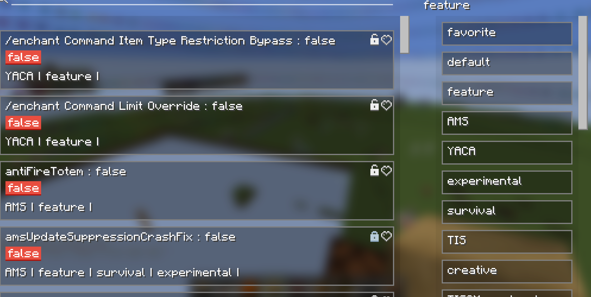
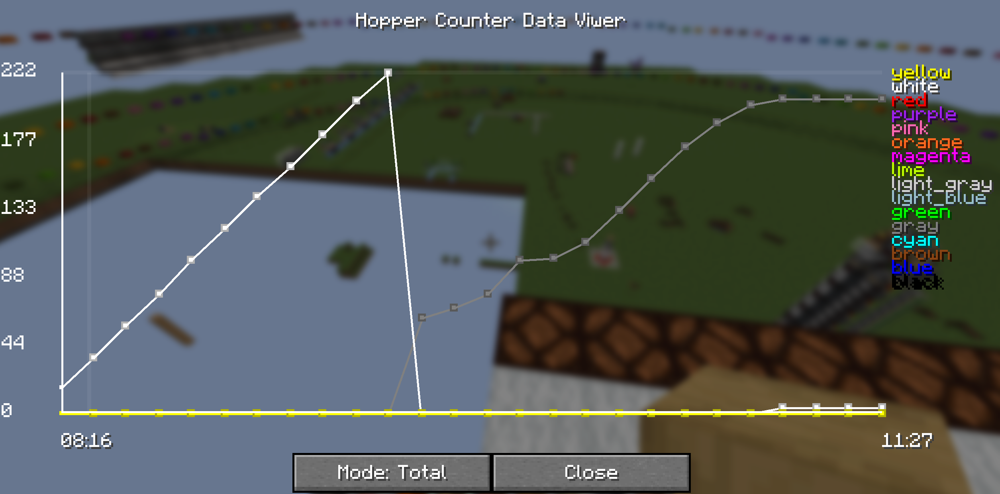

# YACA Carpet Rule Documentation

**Yet Another Carpet Addition (YACA)** is an extension for the Carpet Mod. It provides a variety of debugging tools,
performance optimizations, and game mechanic adjustments. Below is a full list of rules and their descriptions.

[中文版/ChineseVersion](./README-zn_ch.md)

---

## 🧭Main Functional Rules

### `enableTickStepCounter` - Tick Step Counter

* **Description**: Enables a tick counter when `/tick freeze` is active, allowing you to track how many game ticks have
  advanced.
* **Use Case**: Useful for analyzing game progress while the game is frozen.

---

## ⛓Mechanic Modification

### `stopCheckEntityDespawn` - Stop Entity Despawn Check

* **Description**: Prevents the game from automatically despawning entities.

### `stopTickingEntities` - Stop Entity Ticking

* **Description**: Prevents entities like mobs, animals, and players from updating each tick.

### `stopTickingBlockEntities` - Stop Block Entity Ticking

* **Description**: Freezes block entities like chests, furnaces, etc., from updating.

### `stopTickingSpawners` - Stop Spawner Ticking

* **Description**: Halts mob spawner activation and spawning behavior.

---

## 🌍World Update Freeze Rules

### `stopTickingWorldBorder` - Stop World Border Updates

* **Description**: Prevents world border state from updating every tick.

### `stopTickingWeather` - Stop Weather Updates

* **Description**: Disables weather systems like rain and thunderstorms.

### `stopTickingTime` - Stop Time Progression

* **Description**: Pauses the day/night cycle.

### `stopTickingBlocks` - Stop Block Updates

* **Description**: Freezes scheduled and random ticks such as crop growth and redstone updates.

### `stopTickingFluids` - Stop Fluid Updates

* **Description**: Prevents fluid flow updates for water, lava, etc.

### `stopTickingRaid` - Stop Raid Updates

* **Description**: Pauses the progression of village raids.

### `stopTickingChunkManager` - Stop Chunk Manager Updates

* **Description**: Stops chunk loading and unloading logic from running.

### `stopTickingBlockEvents` - Stop Block Event Updates

* **Description**: Freezes block event queues (e.g., piston behavior).

### `stopTickingDragonFight` - Stop Ender Dragon Fight Updates

* **Description**: Pauses the dragon fight sequence in the End.

---

## 🔧Command Enhancements and Utilities

### `bypassModifyPlayerDataRestriction` - Bypass Player Data Restrictions

* **Description**: Allows modification of player NBT using the `/data` command.
* **Note**: Experimental; may cause unexpected behavior.

### `bypassCrashForcibly` - Forcibly Prevent Crashes

* **Description**: Attempts to forcibly catch all exceptions during server ticks to avoid crashes.
* **Note**: May interfere with proper crash debugging.

### `enableMountPlayers` - Enable Player Mounting

* **Description**: Allows entities to ride players and vice versa.
* **Note**: Experimental; may cause crashes or weird behavior.

### `enchantCommandLimitOverwrite` - Enchant Command Level Cap Removal

* **Description**: Allows using `/enchant` with enchantment levels up to 255.

### `enchantCommandBypassItemType` - Enchant Any Item

* **Description**: Removes item-type restrictions from `/enchant`.

### `mergeSmartAndRegularCommandSuggestions` - Merge Command Suggestions

* **Description**: Merges smart and regular command suggestions for Carpet rule commands.

### `silenceTP` - Silent Teleportation

* **Description**: Temporarily sets real players to spectator mode during teleport to avoid detection.

### `commandEasyItemShadowing` - Easy Item Shadowing

* **Description**: Use `/itemshadowing` to quickly copy the main-hand item to the off-hand.

### `commandRenameItem` - Quick Rename Item

* **Description**: Use `/rename <name>` to rename the item in your hand. Pass an empty name to reset.

---

## 🧪 Dangerous Features (May Cause Crashes)

### `instantSchedule` - Instant Scheduled Ticks

* **Description**: Processes all scheduled tick events immediately.
* **Warning**: May cause crashes or world corruption.

### `instantFalling` - Instant Falling Blocks

* **Description**: Causes blocks like sand and gravel to fall instantly.

---

## 🏗Structure and Behavior Optimization

### `optimizedStructureBlock` - Optimize Structure Block

* **Description**: Improves performance of structure blocks when scanning corner regions.

### `morphMovingPiston` - Morphing Moving Piston

* **Description**: Improves accuracy of moving pistons simulating the behavior of held blocks.
* **Note**: Experimental; may behave unexpectedly.

### `movingPistonSpeed` - Moving Piston Speed

* **Description**: Controls the animation speed of piston movements.

---

## 🛏 Miscellaneous Functional Enhancements

### `bedsRecordSleeperFacing` - Beds Record Player Facing

* **Description**: Stores the direction players face when going to bed.

### `copyablePlayerMessages` - Copyable Player Messages

* **Description**: Allows chat messages to be copied (client-side enhancement).

### `moreHardCollisions` - More Hard Collisions

* **Description**: Adds physical collision boxes between more entity types.
* **Note**: May behave unexpectedly or cause performance issues.

### `farlandReintroduced` - Far Lands Reintroduced

* **Description**: Brings back the Beta-era Far Lands world generation.

### `fallingSnowLayers` - Falling Snow Layers

* **Description**: Snow layers fall under gravity like sand blocks.

---

## 🌟Visualization Tools

### `scheduledTickVisualize` - Visualize Scheduled Ticks

* **Description**: Renders scheduled tick data in the world (Red = time to trigger, Green = priority, Blue = creation
  order).

### `hopperCooldownVisualize` - Hopper Cooldown Visualization

* **Description**: Displays the cooldown state of each hopper.

### `randomTickVisualize` - Random Tick Visualization

* **Description**: Shows positions hit by random ticks.

### `gameEventVisualize` - Game Event Visualization

* **Description**: Visualizes events like footsteps and block interactions.

### `blockEventVisualize` - Block Event Visualization

* **Description**: Visualizes the execution order of block events like pistons.

---

## 🔦 Light Control Features

### `forceMaxLightLevel` - Force Max Light Level

* **Description**: Sets both block and sky light levels to 15 everywhere.
* **Note**: May cause rendering or gameplay issues.

### `disableLightUpdate` - Disable Light Updates

* **Description**: Prevents light propagation and recalculations, making lighting static.
* **Note**: May cause inconsistencies.

---

## 📱GUI Features

### Carpet Rule GUI (Default: F9)

* **Description**: GUI interface for managing Carpet rules.
  
* **Note**: Requires both client and server to have YACA installed.

### Hopper Counter GUI (/counterGUI)

* **Description**: GUI interface for the hopper counter system.
  

* **Setup**:

    * Set the `HopperCounterDataRecorder` rule to any number other than `off` — this number defines how often (in ticks)
      hopper data is recorded.
    * Ensure the `hopperCounters` rule is enabled.

* **Warning**: This is a beta feature and may have bugs.

    * After use, disable `HopperCounterDataRecorder` by setting it to `off`.
    * *(Optional)*: Clear hopper counter data to remove stored cache.

